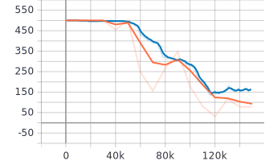
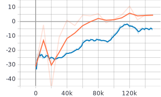

# deep-activate-localization/src/rl_agents/results

*blue - training curve, orange - evaluation curve*
| Result     | AverageEpisodeLength      | AverageEpisodeReturn      |
|------------|------------|-------------| 
|[Navigate_Fixed_Goal - (parallel_py_env)](2021-04-29_21-07-57)|||
|[Navigate_Fixed_Goal - (tf_py_env)](2021-04-30_07-15-35)|||
