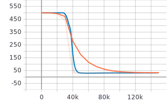
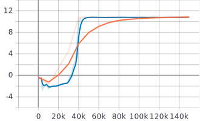
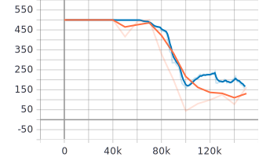
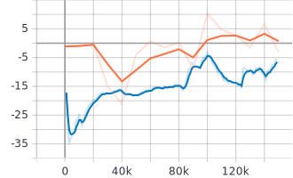
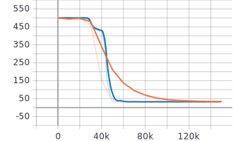
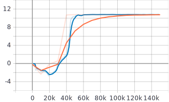
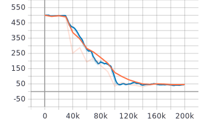
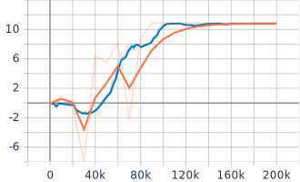

# deep-activate-localization/src/rl_agents/results

*blue - training curve, orange - evaluation curve*
|Experiement | Result     | AverageEpisodeLength      | AverageEpisodeReturn      |
|------------|------------|------------|-------------|
|task_obs only | [Navigate_Fixed_Goal - (parallel_py_env)](2021-04-30_12-19-33)||| -> different train and eval envs with normal_projection_network.NormalProjectionNetwork
|task_obs only | [Navigate_Fixed_Goal - (non-parallel_py_env-1)](2021-04-30_15-00-08)||| -> different train and eval envs with normal_projection_network.NormalProjectionNetwork
|task_obs only | [Navigate_Fixed_Goal - (non-parallel_py_env-2)](2021-04-30_20-07-39)||| -> same train and eval envs with normal_projection_network.NormalProjectionNetwork
|rgb_obs only | [Navigate_Fixed_Goal - (parallel_py_env)](2021-05-03_14-54-25)||| -> different train and eval envs with tanh_normal_projection_network.TanhNormalProjectionNetwork
|rgb_obs only | [Navigate_Fixed_Goal - (non-parallel_py_env)](2021-05-04_07-42-43)||| -> different train and eval envs with tanh_normal_projection_network.TanhNormalProjectionNetwork sac_agent.py
