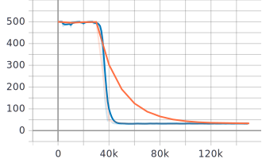
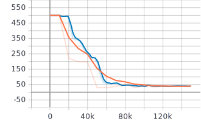
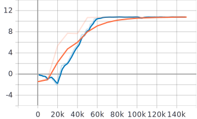
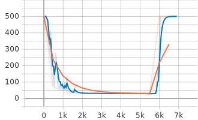
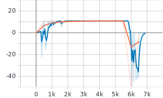
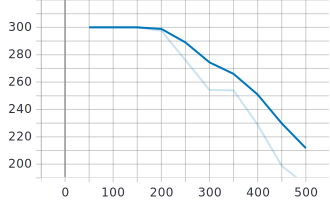
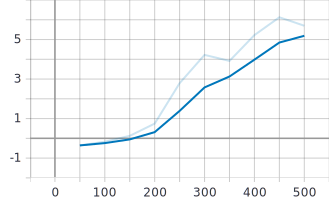

# deep-activate-localization/src/rl_agents/results

  
April 28th - May 4th Summary

  ### Results
  *blue - training curve, orange - evaluation curve*
  |Experiement | Result     | AverageEpisodeLength      | AverageEpisodeReturn      |
  |------------|------------|------------|-------------|
  |task_obs only (2021-04-30)| [Navigate_Fixed_Goal - (parallel_py_env)](2021-04-30_12-19-33)||| -> different train and eval envs with normal_projection_network.NormalProjectionNetwork
  |task_obs only (2021-04-30)| [Navigate_Fixed_Goal - (non-parallel_py_env-1)](2021-04-30_15-00-08)||| -> different train and eval envs with normal_projection_network.NormalProjectionNetwork
  |task_obs only (2021-04-30)| [Navigate_Fixed_Goal - (non-parallel_py_env-2)](2021-04-30_20-07-39)||| -> same train and eval envs with normal_projection_network.NormalProjectionNetwork
  |rgb_obs only (2021-05-03)| [Navigate_Fixed_Goal - (parallel_py_env)](2021-05-03_14-54-25)||| -> different train and eval envs with tanh_normal_projection_network.TanhNormalProjectionNetwork
  |rgb_obs only (2021-05-04)| [Navigate_Fixed_Goal - (non-parallel_py_env)](2021-05-04_07-42-43)||| -> different train and eval envs with tanh_normal_projection_network.TanhNormalProjectionNetwork sac_agent.py

  
May 5th - May 11th Summary

  ### Results
  *blue - training curve, orange - evaluation curve*
  |Experiement | Agent |  Result     | AverageEpisodeLength      | AverageEpisodeReturn      |
  |------------|-------|-----|------------|-------------|
  |task_obs only (2021-05-06)| SAC |[Navigate_Fixed_Goal - (non-parallel_py_env)](2021-05-06_10-06-32)||| -> same train and eval envs with normal_projection_network.NormalProjectionNetwork train_eval.py
  |rgb_obs only (2021-05-07)| SAC |[Navigate_Fixed_Goal - (non-parallel_py_env)](2021-05-07_00-07-34)||| -> same train and eval envs with tanh_normal_projection_network.TanhNormalProjectionNetwork train_eval.py
  |task_obs only (2021-05-12)| PPOClipAgent |[Navigate_Fixed_Goal - (non-parallel_py_env)](2021-05-12_12-46-55)||| -> same train and eval envs with tanh activation non-mini batch training
  |rgb_obs only (2021-05-17)| PPOClipAgent |[Navigate_Fixed_Goal - (non-parallel_py_env)](2021-05-17_08-16-35)||| -> same train and eval envs with tanh activation non-mini batch training

  
May 26th - May 2nd Summary

  ### Results
  *blue - training curve, orange - evaluation curve*

